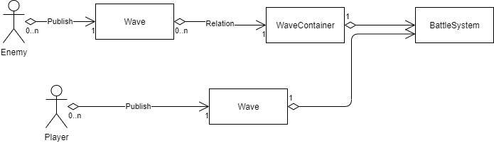

# 2.5D_Project

## 개요
1. 장르: 액션 롤플레잉
2. 사용 엔진: Unity3D
3. 사용 언어: C#
4. 설명: 구글 플레이스토어에 게시된 Mika mobile의 Battle Heart를 모작으로 따라한 프로젝트입니다.
5. 동영상 링크 (이미지를 누르면 이동)

      [](https://www.youtube.com/watch?v=reLnYHgKfJQ)

## 목차 
1.	기본 조작
2.  버프 및 스킬 시스템
3.	상태 시스템
4.	캐릭터의 스킬구현
    -	Paladin
        - Dive Skill
        - Divine Charge Buff
    -	Knight
        - Deadly Poison Buff
        - Haste Buff
    - Mage
        - Ice Nova
        - Teleport Buff
    -	Bishop
        - Cure
        - Pray Aura Buff
5. 전투 시스템
6. 체력 시스템
7. 기타
    - 적 AI
    - Shader Graph

## 1. 기본 조작

 

  기본적인 조작방법은 화면에서 나오는 것처럼 드래그로 기본공격 및 이동을 하며  
  캐릭터를 클릭을 하는 것으로 스킬의 목록을 확인할 수 있습니다. 
  
  캐릭터의 특성에 따라서 기본공격의 대상이 달라질 수 있기 때문에(Bishop은 기본 공격으로 아군의 체력을 Heal로 증가시킨다.)  
  Strategy Pattern을 generic하게 사용하였습니다. 
  
```csharp
public interface ITargetingStrategy
{
    bool IsTargetable(Unit unit);
}

```
```csharp
public class TargetingStrategy<T> : ITargetingStrategy  where T : Unit 
{
    public bool IsTargetable(Unit unit)
    {
        if (null == unit)
            return false;

        if (null != unit as T)
        {
            return true;
        }
        else
        {
            return false;
        }
    }
}
```
    

## 2. 버프 및 스킬 시스템

```csharp
public class BuffSystem 
{
...
    public event EventHandler OnBuffsChanged;
...
    private List<Buff> buffList = new List<Buff>();
    public void Tick(float deltaTime)
    {
        for (int i = 0; i < buffList.Count; i++)
        {
            buffList[i].Tick(Time.deltaTime);
            if (buffList[i].IsEnded())
            {
                buffList.RemoveAt(i);
                OnBuffsChanged?.Invoke(this, EventArgs.Empty);
                return;
            }
        }
    }
...

```

```csharp

public class SkillSystem 
{
...
   private Skill[] skillList = new Skill[SkillCount];
...
    public void Tick(float deltaTime)
    {
        for (int i = 0; i < skillList.Length; i++)
        {
            skillList[i]?.Tick(deltaTime);
        }
    }
...

```
버프는 BuffSystem, 스킬은 SkillSystem의 클래스 객체 내에서 매번 deltaTime마다 Tick 함수로 갱신하도록 만들었습니다.  

## 3. 상태 시스템

 

캐릭터의 기본적인 상태에 대한 시스템은 스택을 활용한 푸시다운 오타마타를 사용하였습니다.  

 

예를 들어 지금 캐릭터가 Idle 상태에서 상대를 추격하여 움직인다면 스택에 ChaseState가 들어가서 현재 상태가 갱신되고, 여기서 스킬을 사용한다면 그 SkillState가 들어가서 현재의 상태가 다시 갱신이 됩니다.  

여기서 SkillState가 끝나게 되면 다시 ChaseState 상태가 되고 여기서 공격을 한다면 ChaseState가 빠지고 AttackState가 들어가게 됩니다.  


  


State가 전이될 때 한번은 스택을 참조한다는 점을 이용하여서 스택을 관리하는 StateSystm을 만들어서 각각의 State들이 StateSystem(mediator)을 매개로 간접적으로 참조하도록 만들었습니다.

## 4. 캐릭터의 스킬 구현  

### 1. Paladin  

#### o Dive Skill


이 스킬을 사용하면 타게팅되는 대상이 범위 밖이면 skill이 isChasing상태로 바뀌어서 skill UI가 빛나는 상태로 바뀌도록 하였습니다.  

스킬을 사용중인 상황에서는 캐릭터가 포물선 운동을 하며 스킬이 끝나면 그 주위에 있는 적에게 데미지를 주고 스턴 상태에 빠지도록 구현하였습니다

```csharp
    public override void Tick(float deltaTime)
    {
        base.Tick(deltaTime);

        /*
         * Tick 함수는 player.SetPosition() 함수로 deltaTime 마다 
         * player를 포물선 운동시킨다
         */
        owner.SetPosition(new Vector3(originPosition.x + (targetPosition.x - originPosition.x) * lagTime / totalTime,
                                    -constant * totalTime * lagTime + constant * (lagTime * lagTime) + originPosition.y,
                                    originPosition.z + (targetPosition.z - originPosition.z) * lagTime / totalTime));

    }

    public override void End()
    {
        base.End();
        GameObject smoke = GameObject.Instantiate(smokeExplosion, owner.GetPosition(), Quaternion.Euler(90f, 0f, 0f));
        Collider[] colliders = Physics.OverlapSphere(owner.GetPosition(), 2f);
        for(int i = 0; i < colliders.Length; i++)
        {
            if(colliders[i].TryGetComponent<Unit>(out Unit targetedUnit))
            {
                if (false == owner.IsTargetable(targetedUnit))
                    continue;
                targetedUnit.GetBuffSystem().AddBuff(GameAssets.Instance.CreateBuff(BuffType.Stun));
                damageStrategy.Do(targetedUnit, damage);
            }
        }
    }

```

#### o Divine Charge Buff


버프 시스템과 Decorator Pattern을 이용하여 시간, 데미지 입는 대상, 스킬 스택이 바뀌도록 구현하였습니다. 

 Decorator pattern을 이용하여 데미지를 주는 것을 담당하는 DamageStrategy를 2번 감싸는 형식으로 구현하였습니다.  

1번째는 주변에도 같이 데미지를 입도록 타겟의 일정 거리 안에 있는 적에게 데미지를 입히도록 구현하였습니다.  

2변째는 공격을 할 때마다 공격을 했다는 Event를 발생시키는 Decorator를 만들어 구현하였습니다.  

Decorator를 빼서 일반 공격으로 돌아가는 코드는 Command Pattern을 활용하였습니다. 
왜냐하면 Knight의 Deadly Poison Buff를 빼는 것도 같은 코드라서 유지, 보수성을 높이기 위해서입니다. 

```csharp
public abstract class DamageStrategyDecorator : IDamageStrategy
{
    protected IDamageStrategy damageStrategy;
    public readonly BuffType DecoratingBuffType;
    public DamageStrategyDecorator(IDamageStrategy damageStrategy, BuffType DecoratingBuffType)
    {
        this.damageStrategy = damageStrategy;
        this.DecoratingBuffType = DecoratingBuffType;
    }

    public void SetDamageStrategy(IDamageStrategy damageStrategy)
    {
        this.damageStrategy = damageStrategy;
    }

    public IDamageStrategy GetDamageStrategy()
    {
        return damageStrategy;
    }

    public abstract void Do(Unit targetUnit, int damage);   
}

```

```csharp
public class RemoveDamageStrategeDecoratorCommand : Command
{
    private BuffType buffType;
    ...
    public override void Execute()
    {
        while (true)
        {
            DamageStrategyDecorator damageStrategyDecorator = owner.GetAttackStrategy().GetDamageStrategy() as DamageStrategyDecorator;
            if (null == damageStrategyDecorator)
                return;
            if (buffType == damageStrategyDecorator.DecoratingBuffType)
            {
                IDamageStrategy damageStrategy = damageStrategyDecorator.GetDamageStrategy();
                owner.GetAttackStrategy().SetDamageStrategy(damageStrategy);
            }
        }
    }
...

```

### 2. Knight

#### o Deadly Poison Buff


버프 시스템을 이용하여 구현하였으며  
 게임 루프 패턴을 이용하여 일정시간마다 데미지를 주도록 구현하였습니다. 

 ```csharp
    public override void Tick(float deltaTime)
    {
        lagTime += deltaTime;
        while(lagTime > damagePeriod)
        {
            lagTime -= damagePeriod;
            basicFXVisualizer.Paint(Color.green);
            trueDamageStrategy.Do(owner, trueDamage);
        }
        base.Tick(deltaTime);

    }

 ```

 #### o Haste Buff

마찬가지로 버프 시스템을 이용하여 구현하였으며  
MoveSystem에 접근하여 캐릭터의 이동속력을 올리는 버프입니다.  


### 3. Mage
#### o Ice Nova

Singleton 클래스인 BattleSystem에 접근하여 현재 있는 모든 적에게 데미지와 Slow 디버프를 주며,  
Singleton 클래스인 Blinder에 접근하여 화면이 잠시 하얀색에서 점점 희미해지게 구현하였습니다. 

```csharp
    private void Work()
    {
        List<Enemy> enemies = BattleSystem.Instance.GetEnemyWave().GetAllUnit();
        for (int i = 0; i < enemies.Count; i++)
        {
            trueDamageStrategy.Do(enemies[i], 30);
            enemies[i].GetBuffSystem().AddBuff(slowDebuff);
        }
        Blinder.Instance.Paint(Color.white);
        Blinder.Instance.FadeOut(1f);
    }

```
#### o Teleport Buff

유닛의 이동을 Strategy패턴으로 구현해서 버프 시간 동안에 다른 MoveStratgy로 갈아 끼우는 형식으로 구현했습니다.

### 4. Bishop
#### o Cure

Ice Nova와 마찬가지로 Singleton 클래스인 BattleSystem에 접근하여 아군유닛들을 25%의 체력만큼 회복시키도록 만들었습니다.  


#### o Pray Aura Buff


시전자 주변에 있는 아군들에게 이동속도, 공격력, 방어력을 향상해 주는 버프입니다. 

일정한 사이클 시간마다 주변에 있는 아군들에게 지속시간이 짧은 버프를 계속 주는 형식으로 구현하였으며,  

주변에서 멀어질 경우 지속시간이 짧은 버프가 시간이 다되서 빠지도로 구현하였습니다.  

```csharp
    public override void Tick(float deltaTime)
    {
        base.Tick(deltaTime);
        lagTime += deltaTime;
        if (checkCycle > lagTime)
            return;
        lagTime -= checkCycle;      			
        Collider[] colliders = Physics.OverlapSphere(owner.GetPosition(), radius);
        for(int i = 0; i < colliders.Length; i++)
        {			
            if(colliders[i].TryGetComponent<Unit>(out Unit buffedUnit))
            {
                if (false == targetingStrategy.IsTargetable(buffedUnit))
                    break;
                buffedUnit.GetBuffSystem().AddBuff(buff);
            }			
        }        
    }

```

## 5. 전투 시스템



전투의 승리의 조건은 적의 Wave를 다 없앨 시, 전투의 패배의 조건은 플레이어의 Wave의 유닛이 다 죽을 때입니다.  

BattleSystem을 Singleton으로 구현하여 적이든 아군이든  
모든 클래스에서 접근이 가능하도록 만들었습니다.  

Unit이 죽을 때마다 event를 발생시키도록 만들었으며,  
BattleSystem에서는 FSM으로 상태가 나뉘도록 만들었습니다.

```csharp
    private void Update()
    {
        switch(state)
        {
        case State.Idle:
            lagTime += Time.deltaTime;
            if(lagTime > waitTime)
            {
                lagTime = 0f;
                state = State.Battle;
            }
            return;
        case State.Battle:
            if (Wave<Enemy>.State.Hide == enemyWaveContainer.GetCurrentWave().GetState())
                enemyWaveContainer.GetCurrentWave().Show();

            if (enemyWaveContainer.IsCurrentWaveEnd())
                enemyWaveContainer.SkipToNextWave();

            if (enemyWaveContainer.IsAllWavesEnd() || Wave<Player>.State.End ==  playerWave.GetState())
                state = State.End;
            else
                state = State.Idle;
            return;
        case State.End:
            if (Wave<Player>.State.End == playerWave.GetState())
                PlayerLose();

            if (true == enemyWaveContainer.IsAllWavesEnd())
                PlayerWin();            
            return;
        }
    }

```

## 6. 체력 시스템


체력 시스템에서는 체력이 닳거나 회복할때 또는 유닛이 죽을 때 event를 발생시켜서  
Observer Pattern에서 Subject(Publisher) 역할을 하도록 만들었습니다.  

```csharp
public class HealthPointsSystem 
{
    public delegate void UnitDeadEventHandler(Unit owner);
    public delegate void HealthPointsChangeEventHandler();
    public event HealthPointsChangeEventHandler OnHealthPointsChanged;
    public event UnitDeadEventHandler OnDead;
...

```

UI로 보여지는 체력이 점차 닳는 효과는 FSM과 while을 이용하여 구현하였습니다.  

그 결과 더욱 세밀하게 체력을 표현할 수 있었습니다.

```csharp
public class UI_HealthPointsModule : MonoBehaviour
{
    ...
    private enum State
    {
        Default,
        Increasing,
        Decreasing,
    }
	...
    private void Update()
    {
        lagTime += Time.deltaTime;
        switch(state)
        {
        case State.Default:
            if (3f < lagTime)
            {
                lagTime = 0f;                
                animator.Play("Disappear");
            }
            break;                 
        case State.Increasing:
            //Game loop pattern 
            while (healthPointsBar.fillAmount + DELTA_HEALTH_POINTS_PROPORTION < healthPointsProportion && lagTime >= SECOND_PER_FRAME)
            {
                IncreaseHealthPoints();
                lagTime -= SECOND_PER_FRAME;                
            }   
            if(healthPointsBar.fillAmount + DELTA_HEALTH_POINTS_PROPORTION >= healthPointsProportion)
                state = State.Default;            
            break;
        case State.Decreasing:
            //Game loop pattern
            while (healthPointsBar.fillAmount - DELTA_HEALTH_POINTS_PROPORTION > healthPointsProportion && lagTime >= SECOND_PER_FRAME)
            {
                DecreaseHealthPoints();
                lagTime -= SECOND_PER_FRAME;                
            }
            if(healthPointsBar.fillAmount - DELTA_HEALTH_POINTS_PROPORTION <= healthPointsProportion)
                state = State.Default;
            break;
        }
    }
    ...
```

## 7. 기타


### 1. 적 AI

적 AI는 플레이어에서 사용한 Command를 그대로 이용하여 구현하였습니다.
```csharp
public class EnemyBasicAIInputListener : EnemyInputListener
{
    private StateSystem enemyStateSystem;
    private ChaseCommand chaseCommand;
    ...
    void Update()
    {
        if(enemyStateSystem.GetIdleState() == enemyStateSystem.GetCurrentState())
        {
            Player randomPlayer = BattleSystem.Instance.GetPlayerWave().GetRandomUnit();
            if(null != randomPlayer)
                chaseCommand.Execute(enemy, randomPlayer);
        }
    }

}
```
### 2. Shader Graph
 
마우스가 캐릭터로 들어가면 나타나는 Glow효과는 Shader Graph와 Coroutine을 활용하였습니다.  


  

몬스터가 나올 소환될 때 나는 이펙트 또한 Shader Graph를 이용하여 제작하였고   

노이즈와 Round함수를 이용해서 점점 나타나는 효과를 구현하였습니다.

